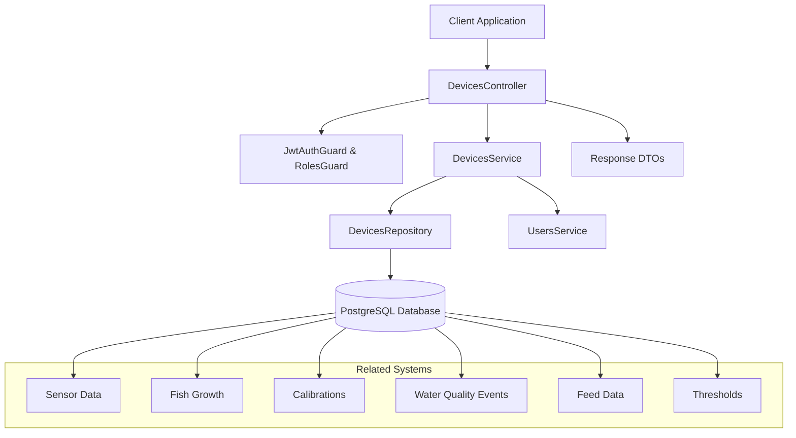
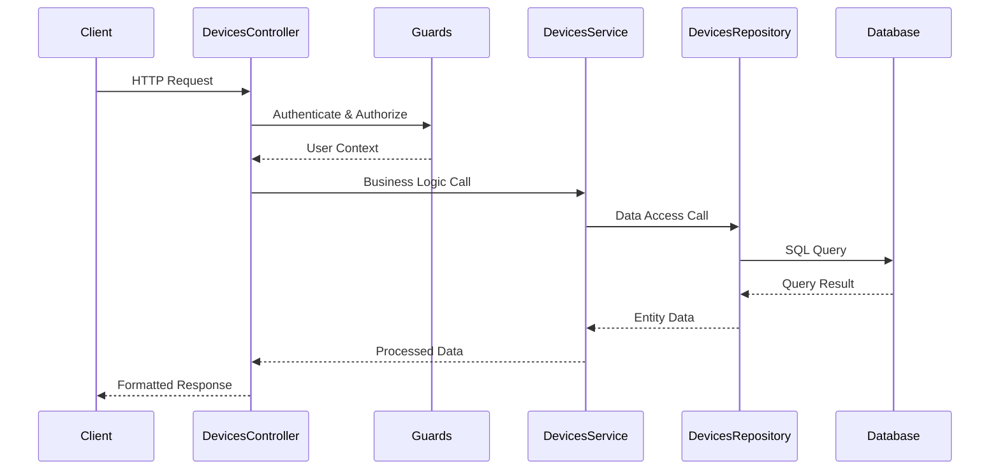

# Device Management Design Document

## Overview

The Device Management system is a core component of the SimonAir aquarium monitoring platform, built using NestJS with TypeORM for database operations. The system provides comprehensive device lifecycle management including registration, configuration, status tracking, and integration with related monitoring subsystems.

The design follows a layered architecture pattern with clear separation of concerns between controllers, services, repositories, and data transfer objects. Authentication and authorization are handled through JWT tokens with role-based access control.

## Architecture

### System Components



### Request Flow



## Components and Interfaces

### Core Entities

#### Device Entity
```typescript
interface DeviceEntity {
  id: string;                    // UUID primary key
  device_id: string;            // Unique device identifier (SMNR-XXXX format)
  user_id: string;              // Foreign key to user
  device_name: string;          // Human-readable device name
  location?: string;            // Physical location description
  aquarium_size?: string;       // Aquarium dimensions
  glass_type?: string;          // Type of aquarium glass
  fish_count: number;           // Number of fish in aquarium
  last_seen?: Date;             // Last communication timestamp
  is_active: boolean;           // Device active status
  created_at: Date;             // Creation timestamp
  
  // Relationships
  user: User;
  sensor_data: SensorData[];
  fish_growth: FishGrowth[];
  calibrations: Calibration[];
  water_quality_events: WaterQualityEvent[];
  feed_data: FeedData[];
  threshold: Threshold;
}
```

### Service Layer Interfaces

#### DevicesService Interface
```typescript
interface IDevicesService {
  create(createDeviceDto: CreateDeviceDto, user: User): Promise<Device>;
  validateRegistration(deviceId: string): Promise<void>;
  getDevices(options: DeviceQueryOptions): Promise<DeviceListResult>;
  findAll(user: User): Promise<Device[]>;
  findOne(deviceId: string, user?: User): Promise<Device>;
  update(id: string, updateDeviceDto: UpdateDeviceDto, user: User): Promise<Device>;
  remove(id: string, user: User): Promise<void>;
  updateLastSeen(deviceId: string): Promise<void>;
  validateDevice(deviceId: string): Promise<Device>;
}
```

#### DevicesRepository Interface
```typescript
interface IDevicesRepository {
  findByDeviceId(deviceId: string): Promise<Device | null>;
  updateLastSeen(deviceId: string): Promise<void>;
  checkExists(deviceId: string): Promise<boolean>;
  findWithPagination(options: PaginationOptions): Promise<[Device[], number]>;
}
```

### Data Transfer Objects

#### Input DTOs
- **CreateDeviceDto**: Device registration data with validation
- **UpdateDeviceDto**: Partial device update data
- **DeviceQueryDto**: Search and pagination parameters

#### Output DTOs
- **DeviceResponseDto**: Standard device information response
- **CreateDeviceResponseDto**: Device creation success response
- **DevicesListResponseDto**: Paginated device list response
- **DeviceDetailResponseDto**: Detailed device information response
- **UpdateDeviceResponseDto**: Device update success response
- **DeleteDeviceResponseDto**: Device deletion confirmation response
- **DeviceErrorResponseDto**: Error response format

## Data Models

### Database Schema

```sql
CREATE TABLE devices (
    id UUID PRIMARY KEY DEFAULT gen_random_uuid(),
    device_id VARCHAR(20) UNIQUE NOT NULL,
    user_id UUID NOT NULL REFERENCES users(id),
    device_name VARCHAR(255) NOT NULL,
    location VARCHAR(255),
    aquarium_size VARCHAR(50),
    glass_type VARCHAR(50),
    fish_count INTEGER DEFAULT 0,
    last_seen TIMESTAMP,
    is_active BOOLEAN DEFAULT true,
    created_at TIMESTAMP DEFAULT CURRENT_TIMESTAMP
);

-- Indexes for performance
CREATE UNIQUE INDEX idx_devices_device_id ON devices(device_id);
CREATE INDEX idx_devices_user_active ON devices(user_id, is_active);
```

### Validation Rules

#### Device ID Validation
- Format: `SMNR-XXXX` where XXXX is alphanumeric
- Must be unique across all devices
- Case-sensitive matching

#### Device Name Validation
- Required field
- Maximum 255 characters
- Cannot be empty string

#### Optional Field Validation
- Location: Maximum 255 characters
- Aquarium Size: Maximum 50 characters
- Glass Type: Maximum 50 characters
- Fish Count: Non-negative integer

## Error Handling

### Error Response Structure
```typescript
interface ErrorResponse {
  status: 'error';
  error: {
    code: number;
    message: string;
    details: string | string[];
  };
  metadata: {
    timestamp: string;
    path: string;
  };
}
```

### Error Categories

#### Validation Errors (400)
- Invalid device ID format
- Missing required fields
- Invalid data types
- Constraint violations

#### Authentication Errors (401)
- Missing or invalid JWT token
- Expired authentication

#### Authorization Errors (403)
- Insufficient permissions
- Attempting to access other user's devices

#### Not Found Errors (404)
- Device does not exist
- Invalid device ID

#### Conflict Errors (409)
- Duplicate device ID registration
- Device already exists

#### Server Errors (500)
- Database connection issues
- Unexpected system errors

## Security Considerations

### Authentication & Authorization
- JWT-based authentication required for all endpoints
- Role-based access control (SUPERUSER, ADMIN, USER)
- User can only access their own devices unless admin/superuser

### Data Protection
- Device ownership validation on all operations
- Input sanitization and validation
- SQL injection prevention through parameterized queries

### Rate Limiting
- API rate limiting through NestJS interceptors
- Caching for frequently accessed data

## Performance Optimizations

### Database Indexing
- Unique index on device_id for fast lookups
- Composite index on (user_id, is_active) for user device queries
- Foreign key indexes for relationship queries

### Caching Strategy
- Cache frequently accessed device information
- Cache interceptor for GET operations
- TTL-based cache invalidation

### Query Optimization
- Pagination for device lists
- Selective field loading
- Eager/lazy loading for relationships based on use case

## Integration Points

### Related System Integration
- **Sensor Data**: One-to-many relationship for sensor readings
- **Fish Growth**: One-to-many relationship for growth tracking
- **Calibrations**: One-to-many relationship for device calibration records
- **Water Quality Events**: One-to-many relationship for alert events
- **Feed Data**: One-to-many relationship for feeding records
- **Thresholds**: One-to-one relationship for device-specific thresholds

### External System Integration
- MQTT service for device communication
- Real-time WebSocket updates for device status
- Email notifications for device alerts

## API Design

### RESTful Endpoints
- `POST /devices` - Create new device // pair as user device authenticated
- `GET /devices` - List user's devices with pagination and search // if role admin or superuser return all device with current sensor readings
- `GET /devices/:id` - Get specific device details
- `PATCH /devices/:id` - Update device information
- `DELETE /devices/:id` - Remove device

### Response Format Standardization
All responses follow consistent structure:
```typescript
{
  status: 'success' | 'error',
  data?: any,
  error?: ErrorDetails,
  metadata: {
    timestamp: string,
    path: string,
    executionTime?: number,
    total?: number,
    page?: number,
    limit?: number
  }
}
```

## Testing Strategy

### Unit Testing
- Service layer business logic testing
- Repository layer data access testing
- DTO validation testing
- Error handling scenarios

### Integration Testing
- Controller endpoint testing
- Database integration testing
- Authentication/authorization testing
- Related system integration testing

### End-to-End Testing
- Complete user workflows
- Device lifecycle testing
- Multi-user scenarios
- Performance testing under load