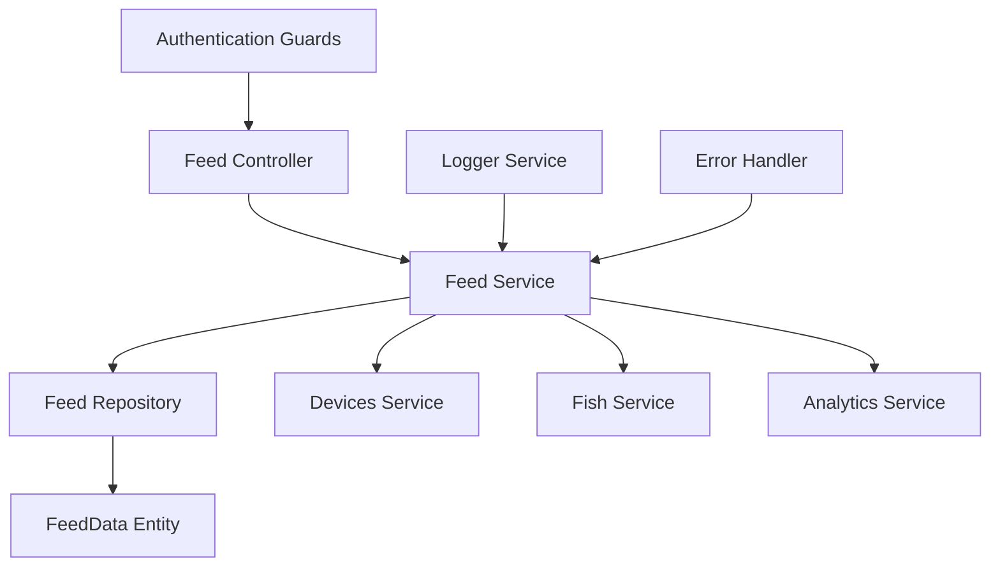
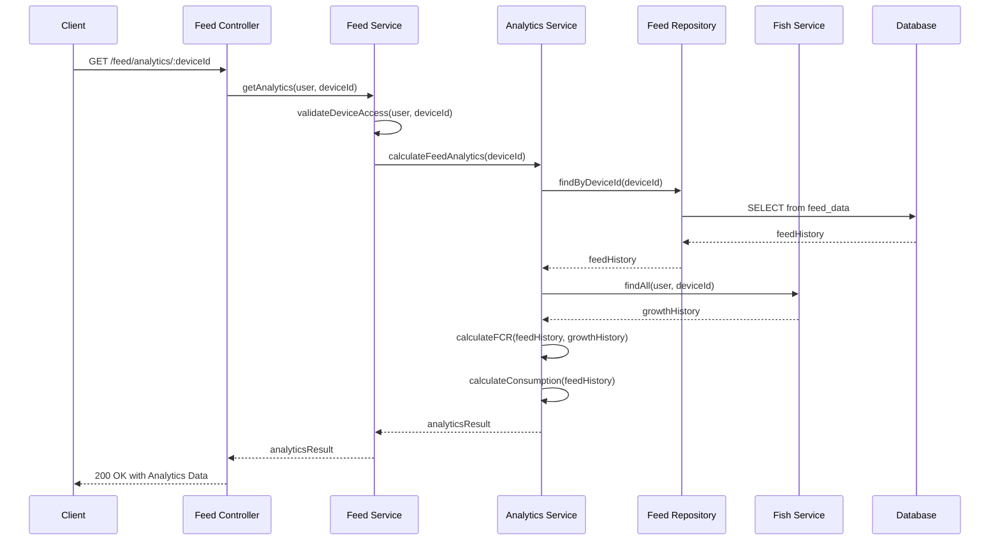

# Design Document

## Overview
This document outlines the design for completing the feed analytics feature within the `feed` module. The goal is to replace the existing placeholder implementation with a robust analytics service that calculates key metrics, correlates feed data with fish growth, and provides valuable insights to the user through a well-defined API.

## Architecture

### Component Architecture


### Data Flow Architecture


## Feature Structure
```
src/modules/feed/
├── services/
│   ├── feed.service.ts
│   └── feed-analytics.service.ts  # New
├── dto/
│   ├── create-feed.dto.ts
│   ├── update-feed.dto.ts
│   └── feed-analytics-response.dto.ts # New
├── exceptions/
│   └── feed.exceptions.ts           # New
├── tests/
│   ├── unit/
│   │   ├── feed.service.spec.ts
│   │   └── feed-analytics.service.spec.ts # New
│   └── integration/
│       └── feed.controller.spec.ts
├── feed.controller.ts
├── feed.module.ts
├── feed.repository.ts
└── feed.service.ts
```

## Components and Interfaces

### Feed Analytics Service Interface
```typescript
interface IFeedAnalyticsService {
  calculateFeedAnalytics(deviceId: string, startDate?: Date, endDate?: Date): Promise<FeedAnalyticsResponseDto>;
  calculateFCR(feedHistory: FeedData[], growthHistory: FishGrowth[]): number;
  calculateTotalConsumption(feedHistory: FeedData[]): { totalAmount: number; byType: Record<string, number> };
  identifyFeedingPatterns(feedHistory: FeedData[]): any;
}
```

### Enhanced Feed Service
```typescript
// In FeedService
async getAnalytics(user: User, deviceId: string): Promise<FeedAnalyticsResponseDto> {
  await this.validateDeviceAccess(user, deviceId);
  return this.feedAnalyticsService.calculateFeedAnalytics(deviceId);
}
```

## Data Models

### Feed Analytics Response DTO
```typescript
// src/modules/feed/dto/feed-analytics-response.dto.ts
import { Expose } from 'class-transformer';

class ConsumptionByType {
  @Expose()
  natural: number;

  @Expose()
  artificial: number;
}

export class FeedAnalyticsResponseDto {
  @Expose()
  feedConversionRatio: number;

  @Expose()
  totalFeedConsumedKg: number;

  @Expose()
  consumptionByType: ConsumptionByType;

  @Expose()
  correlation: string;

  @Expose()
  summary: string;
}
```

## Error Handling

### Custom Exceptions
```typescript
// src/modules/feed/exceptions/feed.exceptions.ts
import { BadRequestException } from '@nestjs/common';

export class InsufficientFeedDataException extends BadRequestException {
  constructor(message: string = 'Insufficient feed data to generate analytics.') {
    super(message);
  }
}
```

## API Design

### RESTful Endpoints
```typescript
// In feed.controller.ts
@Get('analytics/:deviceId')
@Roles(UserRole.USER, UserRole.ADMIN, UserRole.SUPERUSER)
@ApiOperation({ summary: 'Get feed analytics for a device' })
@ApiResponse({ status: 200, description: 'Analytics retrieved successfully.', type: FeedAnalyticsResponseDto })
@ApiResponse({ status: 400, description: 'Insufficient data for analytics.' })
getAnalytics(@CurrentUser() user: User, @Param('deviceId') deviceId: string): Promise<FeedAnalyticsResponseDto> {
  return this.feedService.getAnalytics(user, deviceId);
}
```

Please review and confirm design.md to proceed or request edits.