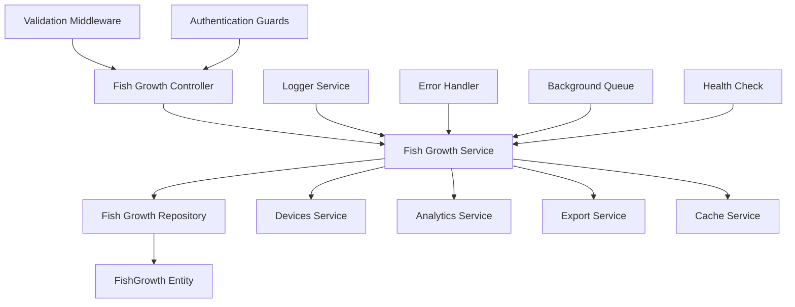
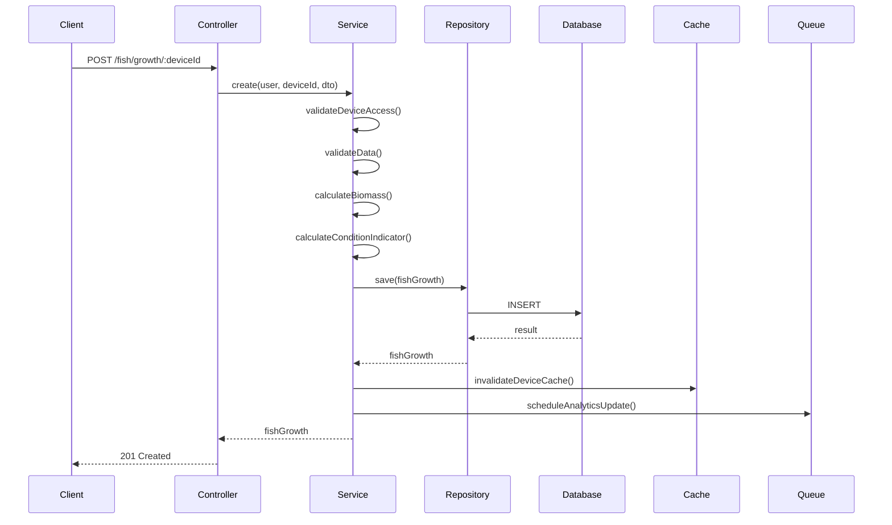
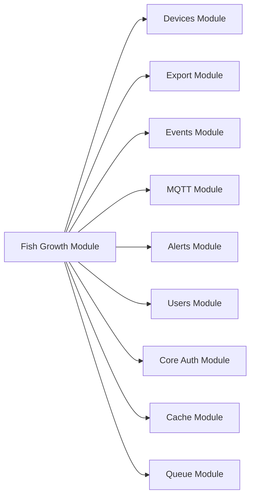

# Design Document

## Overview
The fish growth module design focuses on completing the implementation of fish growth tracking, analytics, and management capabilities for the backend-simonair aquaculture monitoring system. The module will extend the existing basic CRUD operations to include comprehensive validation, advanced analytics, data export capabilities, performance optimizations, and thorough testing coverage while maintaining the existing FishGrowth entity structure.

## Architecture

### Component Architecture


### Data Flow Architecture


### Integration Architecture


## Feature Structure

```
src/modules/fish/
├── controllers/
│   └── fish-growth.controller.ts
├── services/
│   ├── fish-growth.service.ts
│   ├── fish-analytics.service.ts
│   └── fish-export.service.ts
├── repositories/
│   └── fish-growth.repository.ts
├── dto/
│   ├── create-fish-growth.dto.ts
│   ├── update-fish-growth.dto.ts
│   ├── fish-growth-query.dto.ts
│   ├── fish-growth-response.dto.ts
│   ├── fish-analytics-response.dto.ts
│   ├── fish-export-query.dto.ts
│   └── bulk-fish-growth.dto.ts
├── entities/
│   └── fish-growth.entity.ts (existing - no changes)
├── exceptions/
│   ├── fish-growth.exceptions.ts
│   └── fish-validation.exceptions.ts
├── interceptors/
│   └── fish-growth-cache.interceptor.ts
├── validators/
│   └── fish-growth.validator.ts
├── processors/
│   └── fish-analytics.processor.ts
├── tests/
│   ├── unit/
│   │   ├── fish-growth.service.spec.ts
│   │   ├── fish-analytics.service.spec.ts
│   │   └── fish-growth.repository.spec.ts
│   ├── integration/
│   │   └── fish-growth.controller.spec.ts
│   └── e2e/
│       └── fish-growth.e2e-spec.ts
├── fish.module.ts
└── README.md
```

## Components and Interfaces

### Enhanced Service Interface
```typescript
interface IFishGrowthService {
  // Core CRUD operations
  create(user: User, deviceId: string, dto: CreateFishGrowthDto): Promise<FishGrowth>;
  findAll(user: User, deviceId: string, query: FishGrowthQueryDto): Promise<PaginatedResult<FishGrowth>>;
  findOne(user: User, id: string): Promise<FishGrowth>;
  update(user: User, id: string, dto: UpdateFishGrowthDto): Promise<FishGrowth>;
  remove(user: User, id: string): Promise<void>;
  
  // Bulk operations
  bulkCreate(user: User, deviceId: string, dtos: CreateFishGrowthDto[]): Promise<FishGrowth[]>;
  bulkUpdate(user: User, updates: BulkUpdateDto[]): Promise<FishGrowth[]>;
  bulkRemove(user: User, ids: string[]): Promise<void>;
  
  // Analytics operations
  getAnalytics(user: User, deviceId: string, query?: AnalyticsQueryDto): Promise<FishAnalyticsResponse>;
  getGrowthTrends(user: User, deviceId: string, period: string): Promise<GrowthTrendData>;
  getPredictions(user: User, deviceId: string, days: number): Promise<PredictionData>;
  
  // Export operations
  exportData(user: User, deviceId: string, query: ExportQueryDto): Promise<ExportResult>;
  
  // Health and monitoring
  getHealthMetrics(): Promise<HealthMetrics>;
  validateDataIntegrity(deviceId: string): Promise<ValidationResult>;
}
```

### Analytics Service Interface
```typescript
interface IFishAnalyticsService {
  calculateGrowthRate(data: FishGrowth[]): GrowthRateData;
  calculateTrendAnalysis(data: FishGrowth[]): TrendAnalysisData;
  generatePredictions(data: FishGrowth[], days: number): PredictionData;
  calculateStatistics(data: FishGrowth[]): StatisticsData;
  comparePerformance(deviceIds: string[], period: string): ComparisonData;
}
```

### Repository Interface
```typescript
interface IFishGrowthRepository {
  // Enhanced CRUD operations
  create(dto: CreateFishGrowthDto): FishGrowth;
  save(entity: FishGrowth): Promise<FishGrowth>;
  findWithPagination(options: FindWithPaginationOptions): Promise<PaginatedResult<FishGrowth>>;
  findByDeviceId(deviceId: string, options?: FindOptions): Promise<FishGrowth[]>;
  findByDateRange(deviceId: string, startDate: Date, endDate: Date): Promise<FishGrowth[]>;
  findLatestByDevice(deviceId: string): Promise<FishGrowth | null>;
  
  // Bulk operations
  bulkInsert(entities: FishGrowth[]): Promise<FishGrowth[]>;
  bulkUpdate(updates: BulkUpdateData[]): Promise<FishGrowth[]>;
  bulkDelete(ids: string[]): Promise<void>;
  
  // Analytics queries
  getGrowthStatistics(deviceId: string, period: string): Promise<GrowthStatistics>;
  getDeviceComparison(deviceIds: string[], period: string): Promise<ComparisonData>;
  
  // Data validation
  findDuplicates(deviceId: string): Promise<FishGrowth[]>;
  validateDataIntegrity(deviceId: string): Promise<ValidationResult>;
}
```

## Data Models

### Enhanced DTOs
```typescript
// Fish Growth Query DTO
export class FishGrowthQueryDto {
  @IsOptional()
  @IsDateString()
  startDate?: string;

  @IsOptional()
  @IsDateString()
  endDate?: string;

  @IsOptional()
  @IsInt()
  @Min(1)
  @Max(100)
  limit?: number = 20;

  @IsOptional()
  @IsInt()
  @Min(0)
  offset?: number = 0;

  @IsOptional()
  @IsString()
  @IsIn(['measurement_date', 'created_at', 'weight_gram', 'length_cm'])
  sortBy?: string = 'measurement_date';

  @IsOptional()
  @IsString()
  @IsIn(['ASC', 'DESC'])
  sortOrder?: 'ASC' | 'DESC' = 'ASC';

  @IsOptional()
  @IsString()
  search?: string;
}

// Fish Analytics Response DTO
export class FishAnalyticsResponseDto {
  @Expose()
  growthRate: number;

  @Expose()
  trend: string;

  @Expose()
  summary: string;

  @Expose()
  statistics: StatisticsData;

  @Expose()
  predictions?: PredictionData;

  @Expose()
  comparison?: ComparisonData;

  @Expose()
  data: GrowthDataPoint[];
}

// Bulk Operations DTO
export class BulkFishGrowthDto {
  @IsArray()
  @ValidateNested({ each: true })
  @Type(() => CreateFishGrowthDto)
  measurements: CreateFishGrowthDto[];

  @IsOptional()
  @IsBoolean()
  skipValidation?: boolean = false;

  @IsOptional()
  @IsBoolean()
  continueOnError?: boolean = false;
}
```

### Response Data Models
```typescript
// Paginated Result
export interface PaginatedResult<T> {
  data: T[];
  total: number;
  page: number;
  limit: number;
  totalPages: number;
}

// Growth Statistics
export interface GrowthStatistics {
  averageGrowthRate: number;
  totalGrowth: number;
  minWeight: number;
  maxWeight: number;
  averageWeight: number;
  minLength: number;
  maxLength: number;
  averageLength: number;
  measurementCount: number;
  conditionDistribution: Record<string, number>;
}

// Trend Analysis Data
export interface TrendAnalysisData {
  direction: 'increasing' | 'decreasing' | 'stable';
  confidence: number;
  trend: 'linear' | 'exponential' | 'logarithmic';
  correlation: number;
  seasonality?: SeasonalityData;
}
```

## Error Handling

### Custom Exceptions
```typescript
// Fish Growth Exceptions
export class FishGrowthNotFoundException extends NotFoundException {
  constructor(id: string) {
    super(`Fish growth record with ID "${id}" not found`);
  }
}

export class InvalidMeasurementDateException extends BadRequestException {
  constructor(date: string) {
    super(`Invalid measurement date: ${date}. Date cannot be in the future`);
  }
}

export class DuplicateMeasurementException extends ConflictException {
  constructor(deviceId: string, date: string) {
    super(`Measurement already exists for device ${deviceId} on ${date}`);
  }
}

export class InsufficientDataException extends BadRequestException {
  constructor(operation: string, required: number, available: number) {
    super(`Insufficient data for ${operation}: requires ${required} records, available ${available}`);
  }
}
```

### Error Response Format
```typescript
export interface ErrorResponse {
  statusCode: number;
  timestamp: string;
  path: string;
  error: string;
  message: string | string[];
  details?: any;
  correlationId?: string;
}
```

## Security Considerations

### Authentication & Authorization
```typescript
// Enhanced Role-Based Access Control
@Controller('fish/growth')
@UseGuards(JwtAuthGuard, RolesGuard, DeviceOwnershipGuard)
export class FishGrowthController {
  @Get(':deviceId')
  @Roles(UserRole.USER, UserRole.ADMIN, UserRole.SUPERUSER)
  @RequireDeviceAccess()
  async findAll() { }

  @Post(':deviceId/bulk')
  @Roles(UserRole.ADMIN, UserRole.SUPERUSER)
  @RequireDeviceAccess()
  async bulkCreate() { }
}
```

### Data Validation & Sanitization
```typescript
// Enhanced Validation Pipeline
export class FishGrowthValidator {
  static validateMeasurementDate(date: Date): void {
    if (date > new Date()) {
      throw new InvalidMeasurementDateException(date.toISOString());
    }
  }

  static validateMeasurementValues(length?: number, weight?: number): void {
    if (length !== undefined && (length <= 0 || length > 100)) {
      throw new BadRequestException('Length must be between 0 and 100 cm');
    }
    if (weight !== undefined && (weight <= 0 || weight > 10000)) {
      throw new BadRequestException('Weight must be between 0 and 10000 grams');
    }
  }

  static sanitizeNotes(notes?: string): string | undefined {
    if (!notes) return undefined;
    return notes.trim().substring(0, 1000); // Limit to 1000 characters
  }
}
```

### Input Sanitization
```typescript
// SQL Injection Prevention
@Injectable()
export class FishGrowthRepository {
  async findByDeviceWithSearch(deviceId: string, search: string): Promise<FishGrowth[]> {
    return this.repository.createQueryBuilder('fish_growth')
      .where('fish_growth.device_id = :deviceId', { deviceId })
      .andWhere('fish_growth.notes ILIKE :search', { search: `%${search}%` })
      .getMany();
  }
}
```

## Performance Optimizations

### Caching Strategy
```typescript
// Redis Cache Implementation
@Injectable()
export class FishGrowthCacheService {
  constructor(@Inject(CACHE_MANAGER) private cacheManager: Cache) {}

  async getCachedAnalytics(deviceId: string, period: string): Promise<FishAnalyticsResponse | null> {
    const key = `fish_analytics:${deviceId}:${period}`;
    return await this.cacheManager.get(key);
  }

  async setCachedAnalytics(deviceId: string, period: string, data: FishAnalyticsResponse): Promise<void> {
    const key = `fish_analytics:${deviceId}:${period}`;
    await this.cacheManager.set(key, data, 3600); // 1 hour TTL
  }
}
```

### Database Optimization
```typescript
// Optimized Queries
export class FishGrowthRepository {
  async findWithPagination(options: FindWithPaginationOptions): Promise<PaginatedResult<FishGrowth>> {
    const queryBuilder = this.repository.createQueryBuilder('fish_growth')
      .leftJoinAndSelect('fish_growth.device', 'device')
      .where('fish_growth.device_id = :deviceId', { deviceId: options.deviceId })
      .orderBy(`fish_growth.${options.sortBy}`, options.sortOrder)
      .skip(options.offset)
      .take(options.limit);

    // Add date range filter if provided
    if (options.startDate && options.endDate) {
      queryBuilder.andWhere('fish_growth.measurement_date BETWEEN :startDate AND :endDate', {
        startDate: options.startDate,
        endDate: options.endDate
      });
    }

    const [data, total] = await queryBuilder.getManyAndCount();
    
    return {
      data,
      total,
      page: Math.floor(options.offset / options.limit) + 1,
      limit: options.limit,
      totalPages: Math.ceil(total / options.limit)
    };
  }
}
```

### Background Processing
```typescript
// Bull Queue for Heavy Operations
@Processor('fish-analytics')
export class FishAnalyticsProcessor {
  @Process('calculate-complex-analytics')
  async handleComplexAnalytics(job: Job<{ deviceId: string, period: string }>): Promise<void> {
    const { deviceId, period } = job.data;
    
    // Perform heavy analytics calculation
    const analytics = await this.fishAnalyticsService.calculateComplexAnalytics(deviceId, period);
    
    // Cache the results
    await this.cacheService.setCachedAnalytics(deviceId, period, analytics);
    
    // Emit real-time update
    this.eventsGateway.emitAnalyticsUpdate(deviceId, analytics);
  }
}
```

## Integration Points

### Device Management Integration
```typescript
// Device Access Validation
@Injectable()
export class DeviceAccessService {
  async validateDeviceAccess(user: User, deviceId: string): Promise<Device> {
    const device = await this.devicesService.findOne(deviceId, user);
    
    if (!device) {
      throw new NotFoundException(`Device ${deviceId} not found`);
    }
    
    if (user.role !== UserRole.ADMIN && device.user_id !== user.id) {
      throw new ForbiddenException('You do not have access to this device');
    }
    
    return device;
  }
}
```

### Export Module Integration
```typescript
// Export Service Integration
@Injectable()
export class FishExportService {
  async exportFishGrowthData(user: User, deviceId: string, query: ExportQueryDto): Promise<ExportResult> {
    // Validate device access
    await this.deviceAccessService.validateDeviceAccess(user, deviceId);
    
    // Fetch data with analytics
    const data = await this.fishGrowthService.findAll(user, deviceId, query);
    const analytics = await this.fishAnalyticsService.getAnalytics(user, deviceId, query);
    
    // Generate export file
    return this.fileGeneratorService.generateExport(data, analytics, query.format);
  }
}
```

### Real-time Events Integration
```typescript
// WebSocket Events
@Injectable()
export class FishGrowthEventService {
  constructor(private eventsGateway: EventsGateway) {}

  async emitGrowthUpdate(deviceId: string, fishGrowth: FishGrowth): Promise<void> {
    await this.eventsGateway.emitToDevice(deviceId, 'fish_growth_update', fishGrowth);
  }

  async emitAnalyticsUpdate(deviceId: string, analytics: FishAnalyticsResponse): Promise<void> {
    await this.eventsGateway.emitToDevice(deviceId, 'fish_analytics_update', analytics);
  }
}
```

## API Design

### RESTful Endpoints
```typescript
// Enhanced Controller
@Controller('fish/growth')
@ApiTags('Fish Growth Management')
@ApiBearerAuth()
export class FishGrowthController {
  // Core CRUD operations
  @Post(':deviceId')
  @HttpCode(HttpStatus.CREATED)
  async create(@Param('deviceId') deviceId: string, @Body() dto: CreateFishGrowthDto): Promise<FishGrowth> {}

  @Get(':deviceId')
  async findAll(@Param('deviceId') deviceId: string, @Query() query: FishGrowthQueryDto): Promise<PaginatedResult<FishGrowth>> {}

  @Get('record/:id')
  async findOne(@Param('id') id: string): Promise<FishGrowth> {}

  @Put('record/:id')
  async update(@Param('id') id: string, @Body() dto: UpdateFishGrowthDto): Promise<FishGrowth> {}

  @Delete('record/:id')
  @HttpCode(HttpStatus.NO_CONTENT)
  async remove(@Param('id') id: string): Promise<void> {}

  // Bulk operations
  @Post(':deviceId/bulk')
  async bulkCreate(@Param('deviceId') deviceId: string, @Body() dto: BulkFishGrowthDto): Promise<FishGrowth[]> {}

  @Put(':deviceId/bulk')
  async bulkUpdate(@Param('deviceId') deviceId: string, @Body() dto: BulkUpdateDto): Promise<FishGrowth[]> {}

  @Delete(':deviceId/bulk')
  @HttpCode(HttpStatus.NO_CONTENT)
  async bulkRemove(@Param('deviceId') deviceId: string, @Body() dto: BulkDeleteDto): Promise<void> {}

  // Analytics endpoints
  @Get(':deviceId/analytics')
  async getAnalytics(@Param('deviceId') deviceId: string, @Query() query: AnalyticsQueryDto): Promise<FishAnalyticsResponse> {}

  @Get(':deviceId/trends')
  async getTrends(@Param('deviceId') deviceId: string, @Query('period') period: string): Promise<GrowthTrendData> {}

  @Get(':deviceId/predictions')
  async getPredictions(@Param('deviceId') deviceId: string, @Query('days') days: number): Promise<PredictionData> {}

  // Export endpoints
  @Get(':deviceId/export')
  async exportData(@Param('deviceId') deviceId: string, @Query() query: ExportQueryDto): Promise<StreamableFile> {}

  // Health and monitoring
  @Get('health')
  async getHealth(): Promise<HealthMetrics> {}

  @Get(':deviceId/validate')
  async validateData(@Param('deviceId') deviceId: string): Promise<ValidationResult> {}
}
```

### API Response Standards
```typescript
// Success Response Format
export interface ApiResponse<T> {
  success: true;
  data: T;
  message?: string;
  pagination?: PaginationMeta;
  timestamp: string;
}

// Error Response Format
export interface ApiErrorResponse {
  success: false;
  error: {
    code: string;
    message: string;
    details?: any;
  };
  timestamp: string;
  path: string;
}
```

## Testing Strategy

### Unit Testing
```typescript
// Service Unit Tests
describe('FishGrowthService', () => {
  let service: FishGrowthService;
  let repository: FishGrowthRepository;
  let devicesService: DevicesService;

  beforeEach(async () => {
    const module = await Test.createTestingModule({
      providers: [
        FishGrowthService,
        {
          provide: FishGrowthRepository,
          useValue: mockRepository
        },
        {
          provide: DevicesService,
          useValue: mockDevicesService
        }
      ]
    }).compile();

    service = module.get<FishGrowthService>(FishGrowthService);
    repository = module.get<FishGrowthRepository>(FishGrowthRepository);
    devicesService = module.get<DevicesService>(DevicesService);
  });

  describe('create', () => {
    it('should create fish growth record successfully', async () => {
      // Test implementation
    });

    it('should throw error for invalid device access', async () => {
      // Test implementation
    });

    it('should calculate biomass correctly', async () => {
      // Test implementation
    });
  });
});
```

### Integration Testing
```typescript
// Controller Integration Tests
describe('FishGrowthController (Integration)', () => {
  let app: INestApplication;
  let fishGrowthService: FishGrowthService;

  beforeEach(async () => {
    const moduleFixture = await Test.createTestingModule({
      imports: [FishModule, AuthModule, DevicesModule],
    }).compile();

    app = moduleFixture.createNestApplication();
    await app.init();
    fishGrowthService = moduleFixture.get<FishGrowthService>(FishGrowthService);
  });

  describe('POST /fish/growth/:deviceId', () => {
    it('should create fish growth record', async () => {
      return request(app.getHttpServer())
        .post('/fish/growth/device123')
        .set('Authorization', 'Bearer valid-token')
        .send(validCreateDto)
        .expect(201)
        .expect((res) => {
          expect(res.body.data.device_id).toBe('device123');
          expect(res.body.data.biomass_kg).toBeDefined();
        });
    });
  });
});
```

### E2E Testing
```typescript
// End-to-End Tests
describe('Fish Growth Module (E2E)', () => {
  let app: INestApplication;
  let authToken: string;

  beforeAll(async () => {
    // Setup test application
    const moduleFixture = await Test.createTestingModule({
      imports: [AppModule],
    }).compile();

    app = moduleFixture.createNestApplication();
    await app.init();

    // Get auth token
    authToken = await getAuthToken(app);
  });

  describe('Complete Fish Growth Workflow', () => {
    it('should complete full CRUD workflow', async () => {
      // Create device
      const device = await createTestDevice(app, authToken);

      // Create fish growth record
      const fishGrowth = await createFishGrowthRecord(app, authToken, device.id);

      // Retrieve records
      const records = await getFishGrowthRecords(app, authToken, device.id);
      expect(records.length).toBe(1);

      // Update record
      const updatedRecord = await updateFishGrowthRecord(app, authToken, fishGrowth.id);
      expect(updatedRecord.weight_gram).toBe(updatedWeight);

      // Get analytics
      const analytics = await getFishGrowthAnalytics(app, authToken, device.id);
      expect(analytics.growthRate).toBeDefined();

      // Delete record
      await deleteFishGrowthRecord(app, authToken, fishGrowth.id);
    });
  });
});
```

### Performance Testing
```typescript
// Performance Tests
describe('FishGrowthService Performance', () => {
  it('should handle bulk operations efficiently', async () => {
    const bulkData = generateBulkTestData(1000);
    const startTime = Date.now();

    await service.bulkCreate(testUser, testDeviceId, bulkData);

    const endTime = Date.now();
    const duration = endTime - startTime;

    expect(duration).toBeLessThan(5000); // Should complete within 5 seconds
  });

  it('should handle large dataset analytics', async () => {
    await seedLargeDataset(10000);
    const startTime = Date.now();

    const analytics = await service.getAnalytics(testUser, testDeviceId);

    const endTime = Date.now();
    const duration = endTime - startTime;

    expect(duration).toBeLessThan(2000); // Should complete within 2 seconds
    expect(analytics.growthRate).toBeDefined();
  });
});
```

Please review and confirm design.md to proceed or request edits.
