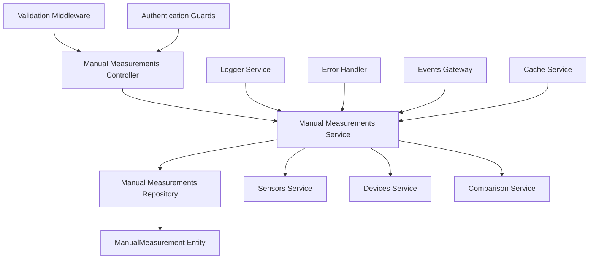
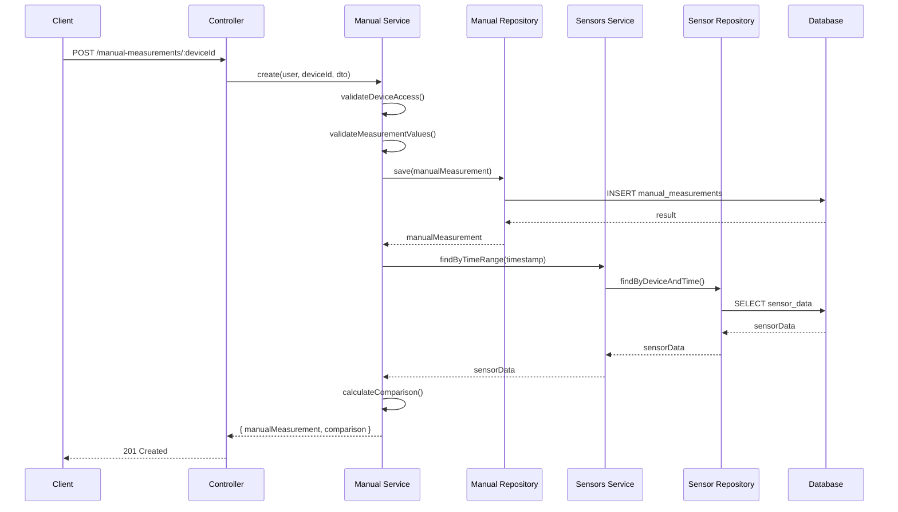
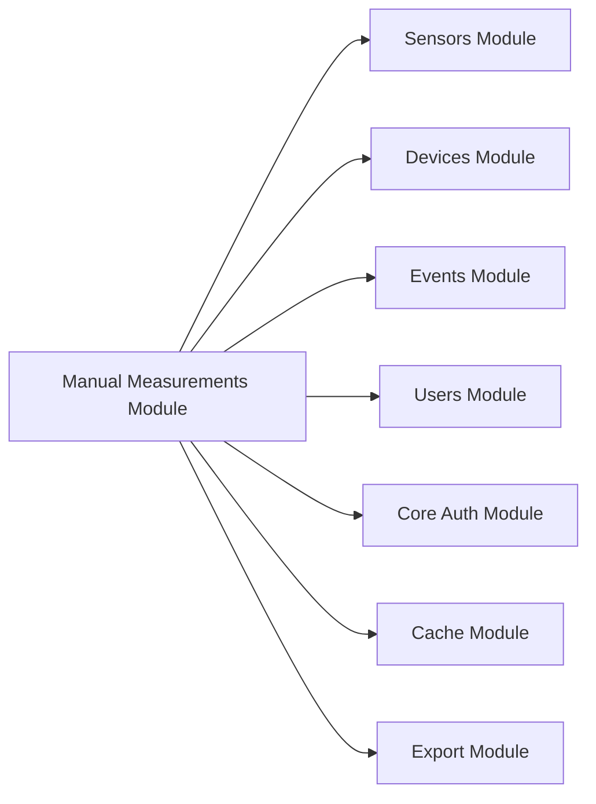

# Design Document

## Overview
The manual measurements feature enables users to manually enter sensor data measurements for their aquaculture devices and compare them with real-time MQTT sensor data. This feature provides data validation, comparison capabilities, and seamless integration with the existing sensor data infrastructure while maintaining separate storage for manual entries.

## Architecture

### Component Architecture


### Data Flow Architecture


### Integration Architecture


## Feature Structure

```
src/modules/manual-measurements/
├── controllers/
│   └── manual-measurements.controller.ts
├── services/
│   ├── manual-measurements.service.ts
│   └── measurement-comparison.service.ts
├── repositories/
│   └── manual-measurements.repository.ts
├── dto/
│   ├── create-manual-measurement.dto.ts
│   ├── manual-measurement-query.dto.ts
│   ├── manual-measurement-response.dto.ts
│   └── measurement-comparison-response.dto.ts
├── entities/
│   └── manual-measurement.entity.ts
├── exceptions/
│   └── manual-measurement.exceptions.ts
├── validators/
│   └── measurement-values.validator.ts
├── tests/
│   ├── unit/
│   │   ├── manual-measurements.service.spec.ts
│   │   └── measurement-comparison.service.spec.ts
│   ├── integration/
│   │   └── manual-measurements.controller.spec.ts
│   └── e2e/
│       └── manual-measurements.e2e-spec.ts
├── manual-measurements.module.ts
└── README.md
```

## Components and Interfaces

### Manual Measurements Service Interface
```typescript
interface IManualMeasurementsService {
  // Core operations
  create(user: User, deviceId: string, dto: CreateManualMeasurementDto): Promise<ManualMeasurementWithComparison>;
  findAll(user: User, deviceId: string, query: ManualMeasurementQueryDto): Promise<PaginatedResult<ManualMeasurement>>;
  findOne(user: User, id: string): Promise<ManualMeasurement>;
  
  // Comparison operations
  compareWithSensorData(manualMeasurement: ManualMeasurement): Promise<MeasurementComparison>;
  findComparisonsInRange(user: User, deviceId: string, startDate: Date, endDate: Date): Promise<ComparisonResult[]>;
  
  // Validation operations
  validateMeasurementValues(dto: CreateManualMeasurementDto): Promise<ValidationResult>;
  checkForDuplicates(deviceId: string, timestamp: Date): Promise<boolean>;
  
  // Export operations
  exportData(user: User, deviceId: string, query: ExportQueryDto): Promise<ExportResult>;
}
```

### Measurement Comparison Service Interface
```typescript
interface IMeasurementComparisonService {
  compareWithSensorData(manualMeasurement: ManualMeasurement, sensorData: SensorData): MeasurementComparison;
  findClosestSensorData(deviceId: string, timestamp: Date, timeWindowMinutes: number): Promise<SensorData | null>;
  calculateDifferences(manual: SensorValues, sensor: SensorValues): ValueDifferences;
  assessAccuracy(differences: ValueDifferences): AccuracyAssessment;
  generateComparisonReport(comparisons: MeasurementComparison[]): ComparisonReport;
}
```

### Repository Interface
```typescript
interface IManualMeasurementsRepository {
  create(dto: CreateManualMeasurementDto): ManualMeasurement;
  save(entity: ManualMeasurement): Promise<ManualMeasurement>;
  findByDeviceId(deviceId: string, options?: FindOptions): Promise<ManualMeasurement[]>;
  findByDateRange(deviceId: string, startDate: Date, endDate: Date): Promise<ManualMeasurement[]>;
  findByTimestamp(deviceId: string, timestamp: Date): Promise<ManualMeasurement | null>;
  findWithPagination(options: FindWithPaginationOptions): Promise<PaginatedResult<ManualMeasurement>>;
  checkDuplicates(deviceId: string, timestamp: Date): Promise<ManualMeasurement[]>;
}
```

## Data Models

### Manual Measurement Entity
```typescript
@Entity('manual_measurements')
@Index(['device_id', 'measurement_timestamp'])
@Index(['device_id', 'created_at'])
export class ManualMeasurement {
  @PrimaryGeneratedColumn('uuid')
  id: string;

  @Column({ type: 'varchar', length: 20 })
  device_id: string;

  @Column({ type: 'uuid' })
  measured_by: string;

  @Column({ type: 'timestamptz' })
  measurement_timestamp: Date;

  @Column({ type: 'decimal', precision: 5, scale: 2, nullable: true })
  temperature: number | null;

  @Column({ type: 'decimal', precision: 4, scale: 2, nullable: true })
  ph: number | null;

  @Column({ type: 'int', nullable: true })
  tds: number | null;

  @Column({ type: 'decimal', precision: 4, scale: 2, nullable: true })
  do_level: number | null;

  @Column({ type: 'text', nullable: true })
  notes: string | null;

  @CreateDateColumn()
  created_at: Date;

  // Relations
  @ManyToOne(() => Device, device => device.manual_measurements)
  @JoinColumn({ name: 'device_id', referencedColumnName: 'device_id' })
  device: Device;

  @ManyToOne(() => User, user => user.manual_measurements)
  @JoinColumn({ name: 'measured_by' })
  user: User;
}
```

### DTOs
```typescript
// Create Manual Measurement DTO
export class CreateManualMeasurementDto {
  @IsDateString()
  @IsNotEmpty()
  measurement_timestamp: string;

  @IsOptional()
  @IsNumber({ maxDecimalPlaces: 2 })
  @Min(0)
  @Max(50)
  temperature?: number;

  @IsOptional()
  @IsNumber({ maxDecimalPlaces: 2 })
  @Min(0)
  @Max(14)
  ph?: number;

  @IsOptional()
  @IsInt()
  @Min(0)
  @Max(10000)
  tds?: number;

  @IsOptional()
  @IsNumber({ maxDecimalPlaces: 2 })
  @Min(0)
  @Max(20)
  do_level?: number;

  @IsOptional()
  @IsString()
  @MaxLength(500)
  notes?: string;

  @IsOptional()
  @IsBoolean()
  compare_with_sensor?: boolean = true;
}

// Manual Measurement Query DTO
export class ManualMeasurementQueryDto {
  @IsOptional()
  @IsDateString()
  startDate?: string;

  @IsOptional()
  @IsDateString()
  endDate?: string;

  @IsOptional()
  @IsInt()
  @Min(1)
  @Max(100)
  limit?: number = 20;

  @IsOptional()
  @IsInt()
  @Min(0)
  offset?: number = 0;

  @IsOptional()
  @IsString()
  @IsIn(['measurement_timestamp', 'created_at'])
  sortBy?: string = 'measurement_timestamp';

  @IsOptional()
  @IsString()
  @IsIn(['ASC', 'DESC'])
  sortOrder?: 'ASC' | 'DESC' = 'DESC';

  @IsOptional()
  @IsBoolean()
  include_comparison?: boolean = false;
}

// Manual Measurement Response DTO
export class ManualMeasurementResponseDto {
  @Expose()
  id: string;

  @Expose()
  device_id: string;

  @Expose()
  measured_by: string;

  @Expose()
  measurement_timestamp: Date;

  @Expose()
  temperature: number | null;

  @Expose()
  ph: number | null;

  @Expose()
  tds: number | null;

  @Expose()
  do_level: number | null;

  @Expose()
  notes: string | null;

  @Expose()
  created_at: Date;

  @Expose()
  @Type(() => UserBasicInfoDto)
  user: UserBasicInfoDto;

  @Expose()
  @Type(() => MeasurementComparisonDto)
  comparison?: MeasurementComparisonDto;
}

// Measurement Comparison DTO
export class MeasurementComparisonDto {
  @Expose()
  sensor_data_available: boolean;

  @Expose()
  sensor_timestamp: Date | null;

  @Expose()
  time_difference_minutes: number | null;

  @Expose()
  temperature_difference: number | null;

  @Expose()
  ph_difference: number | null;

  @Expose()
  tds_difference: number | null;

  @Expose()
  do_level_difference: number | null;

  @Expose()
  accuracy_assessment: AccuracyLevel;

  @Expose()
  flags: string[];

  @Expose()
  sensor_values: SensorValuesDto | null;

  @Expose()
  manual_values: SensorValuesDto;
}
```

### Data Interfaces
```typescript
// Sensor Values Interface
export interface SensorValues {
  temperature?: number;
  ph?: number;
  tds?: number;
  do_level?: number;
}

// Value Differences Interface
export interface ValueDifferences {
  temperature?: number;
  ph?: number;
  tds?: number;
  do_level?: number;
}

// Accuracy Assessment
export enum AccuracyLevel {
  EXCELLENT = 'EXCELLENT',    // < 2% difference
  GOOD = 'GOOD',             // 2-5% difference
  FAIR = 'FAIR',             // 5-10% difference
  POOR = 'POOR',             // 10-20% difference
  VERY_POOR = 'VERY_POOR'    // > 20% difference
}

// Comparison Report
export interface ComparisonReport {
  total_comparisons: number;
  successful_comparisons: number;
  accuracy_distribution: Record<AccuracyLevel, number>;
  average_differences: ValueDifferences;
  recommendations: string[];
}
```

## Error Handling

### Custom Exceptions
```typescript
// Manual Measurement Exceptions
export class ManualMeasurementNotFoundException extends NotFoundException {
  constructor(id: string) {
    super(`Manual measurement with ID "${id}" not found`);
  }
}

export class InvalidMeasurementTimestampException extends BadRequestException {
  constructor(timestamp: string) {
    super(`Invalid measurement timestamp: ${timestamp}. Timestamp cannot be in the future`);
  }
}

export class DuplicateManualMeasurementException extends ConflictException {
  constructor(deviceId: string, timestamp: string) {
    super(`Manual measurement already exists for device ${deviceId} at ${timestamp}`);
  }
}

export class InvalidSensorValueException extends BadRequestException {
  constructor(sensor: string, value: number, min: number, max: number) {
    super(`Invalid ${sensor} value: ${value}. Must be between ${min} and ${max}`);
  }
}

export class NoSensorDataForComparisonException extends BadRequestException {
  constructor(deviceId: string, timestamp: string) {
    super(`No sensor data available for device ${deviceId} near timestamp ${timestamp} for comparison`);
  }
}
```

## Security Considerations

### Authentication & Authorization
```typescript
// Role-Based Access Control
@Controller('manual-measurements')
@UseGuards(JwtAuthGuard, RolesGuard, DeviceOwnershipGuard)
export class ManualMeasurementsController {
  @Get(':deviceId')
  @Roles(UserRole.USER, UserRole.ADMIN, UserRole.SUPERUSER)
  @RequireDeviceAccess()
  async findAll() { }

  @Post(':deviceId')
  @Roles(UserRole.USER, UserRole.ADMIN, UserRole.SUPERUSER)
  @RequireDeviceAccess()
  async create() { }
}
```

### Data Validation & Sanitization
```typescript
// Measurement Values Validator
export class MeasurementValuesValidator {
  static validateTemperature(value?: number): void {
    if (value !== undefined && (value < 0 || value > 50)) {
      throw new InvalidSensorValueException('temperature', value, 0, 50);
    }
  }

  static validatePH(value?: number): void {
    if (value !== undefined && (value < 0 || value > 14)) {
      throw new InvalidSensorValueException('pH', value, 0, 14);
    }
  }

  static validateTDS(value?: number): void {
    if (value !== undefined && (value < 0 || value > 10000)) {
      throw new InvalidSensorValueException('TDS', value, 0, 10000);
    }
  }

  static validateDO(value?: number): void {
    if (value !== undefined && (value < 0 || value > 20)) {
      throw new InvalidSensorValueException('DO', value, 0, 20);
    }
  }

  static validateTimestamp(timestamp: Date): void {
    if (timestamp > new Date()) {
      throw new InvalidMeasurementTimestampException(timestamp.toISOString());
    }
  }

  static sanitizeNotes(notes?: string): string | undefined {
    if (!notes) return undefined;
    return notes.trim().substring(0, 500);
  }
}
```

## Performance Optimizations

### Caching Strategy
```typescript
// Comparison Results Cache
@Injectable()
export class ComparisonCacheService {
  constructor(@Inject(CACHE_MANAGER) private cacheManager: Cache) {}

  async getCachedComparison(deviceId: string, timestamp: Date): Promise<MeasurementComparison | null> {
    const key = `comparison:${deviceId}:${timestamp.getTime()}`;
    return await this.cacheManager.get(key);
  }

  async setCachedComparison(deviceId: string, timestamp: Date, comparison: MeasurementComparison): Promise<void> {
    const key = `comparison:${deviceId}:${timestamp.getTime()}`;
    await this.cacheManager.set(key, comparison, 1800); // 30 minutes TTL
  }
}
```

### Database Optimization
```typescript
// Optimized Queries
export class ManualMeasurementsRepository {
  async findWithSensorComparison(deviceId: string, options: FindOptions): Promise<ManualMeasurement[]> {
    return this.repository.createQueryBuilder('manual')
      .leftJoinAndSelect('manual.user', 'user')
      .leftJoinAndSelect('manual.device', 'device')
      .where('manual.device_id = :deviceId', { deviceId })
      .orderBy('manual.measurement_timestamp', 'DESC')
      .limit(options.limit)
      .offset(options.offset)
      .getMany();
  }

  async findClosestSensorData(deviceId: string, timestamp: Date, timeWindowMinutes: number): Promise<SensorData | null> {
    const startTime = new Date(timestamp.getTime() - timeWindowMinutes * 60 * 1000);
    const endTime = new Date(timestamp.getTime() + timeWindowMinutes * 60 * 1000);

    return this.sensorDataRepository.createQueryBuilder('sensor_data')
      .where('sensor_data.device_id = :deviceId', { deviceId })
      .andWhere('sensor_data.time BETWEEN :startTime AND :endTime', { startTime, endTime })
      .orderBy('ABS(EXTRACT(EPOCH FROM (sensor_data.time - :timestamp)))', 'ASC')
      .setParameter('timestamp', timestamp)
      .getOne();
  }
}
```

## Integration Points

### Sensors Module Integration
```typescript
// Sensor Data Integration
@Injectable()
export class MeasurementComparisonService {
  constructor(
    private sensorsService: SensorsService,
    private comparisonCache: ComparisonCacheService
  ) {}

  async compareWithSensorData(manualMeasurement: ManualMeasurement): Promise<MeasurementComparison> {
    // Check cache first
    const cached = await this.comparisonCache.getCachedComparison(
      manualMeasurement.device_id,
      manualMeasurement.measurement_timestamp
    );
    
    if (cached) {
      return cached;
    }

    // Find closest sensor data within 30 minutes
    const sensorData = await this.findClosestSensorData(
      manualMeasurement.device_id,
      manualMeasurement.measurement_timestamp,
      30
    );

    const comparison = this.generateComparison(manualMeasurement, sensorData);
    
    // Cache the result
    await this.comparisonCache.setCachedComparison(
      manualMeasurement.device_id,
      manualMeasurement.measurement_timestamp,
      comparison
    );

    return comparison;
  }

  private generateComparison(manual: ManualMeasurement, sensor: SensorData | null): MeasurementComparison {
    if (!sensor) {
      return {
        sensor_data_available: false,
        sensor_timestamp: null,
        time_difference_minutes: null,
        temperature_difference: null,
        ph_difference: null,
        tds_difference: null,
        do_level_difference: null,
        accuracy_assessment: AccuracyLevel.POOR,
        flags: ['NO_SENSOR_DATA'],
        sensor_values: null,
        manual_values: this.extractManualValues(manual)
      };
    }

    const timeDiff = Math.abs(manual.measurement_timestamp.getTime() - sensor.time.getTime()) / (1000 * 60);
    const differences = this.calculateDifferences(manual, sensor);
    const accuracy = this.assessAccuracy(differences);
    const flags = this.generateFlags(differences, timeDiff);

    return {
      sensor_data_available: true,
      sensor_timestamp: sensor.time,
      time_difference_minutes: timeDiff,
      temperature_difference: differences.temperature,
      ph_difference: differences.ph,
      tds_difference: differences.tds,
      do_level_difference: differences.do_level,
      accuracy_assessment: accuracy,
      flags,
      sensor_values: this.extractSensorValues(sensor),
      manual_values: this.extractManualValues(manual)
    };
  }
}
```

### Real-time Events Integration
```typescript
// WebSocket Events
@Injectable()
export class ManualMeasurementEventService {
  constructor(private eventsGateway: EventsGateway) {}

  async emitMeasurementCreated(deviceId: string, measurement: ManualMeasurement): Promise<void> {
    await this.eventsGateway.emitToDevice(deviceId, 'manual_measurement_created', measurement);
  }

  async emitComparisonResult(deviceId: string, comparison: MeasurementComparison): Promise<void> {
    await this.eventsGateway.emitToDevice(deviceId, 'measurement_comparison_result', comparison);
  }
}
```

## API Design

### RESTful Endpoints
```typescript
// Manual Measurements Controller
@Controller('manual-measurements')
@ApiTags('Manual Measurements')
@ApiBearerAuth()
export class ManualMeasurementsController {
  // Create manual measurement
  @Post(':deviceId')
  @HttpCode(HttpStatus.CREATED)
  @ApiOperation({ summary: 'Create manual measurement' })
  @ApiResponse({ status: 201, description: 'Manual measurement created successfully' })
  async create(
    @Param('deviceId') deviceId: string,
    @Body() dto: CreateManualMeasurementDto,
    @CurrentUser() user: User
  ): Promise<ManualMeasurementResponseDto> {}

  // Get manual measurements
  @Get(':deviceId')
  @ApiOperation({ summary: 'Get manual measurements for device' })
  @ApiResponse({ status: 200, description: 'Manual measurements retrieved successfully' })
  async findAll(
    @Param('deviceId') deviceId: string,
    @Query() query: ManualMeasurementQueryDto,
    @CurrentUser() user: User
  ): Promise<PaginatedResult<ManualMeasurementResponseDto>> {}

  // Get single manual measurement
  @Get('record/:id')
  @ApiOperation({ summary: 'Get manual measurement by ID' })
  @ApiResponse({ status: 200, description: 'Manual measurement retrieved successfully' })
  async findOne(
    @Param('id') id: string,
    @CurrentUser() user: User
  ): Promise<ManualMeasurementResponseDto> {}

  // Compare with sensor data
  @Post('record/:id/compare')
  @ApiOperation({ summary: 'Compare manual measurement with sensor data' })
  @ApiResponse({ status: 200, description: 'Comparison completed successfully' })
  async compareWithSensorData(
    @Param('id') id: string,
    @CurrentUser() user: User
  ): Promise<MeasurementComparisonDto> {}

  // Get comparison report
  @Get(':deviceId/comparison-report')
  @ApiOperation({ summary: 'Get comparison report for device' })
  @ApiResponse({ status: 200, description: 'Comparison report generated successfully' })
  async getComparisonReport(
    @Param('deviceId') deviceId: string,
    @Query('startDate') startDate: string,
    @Query('endDate') endDate: string,
    @CurrentUser() user: User
  ): Promise<ComparisonReport> {}

  // Export manual measurements
  @Get(':deviceId/export')
  @ApiOperation({ summary: 'Export manual measurements' })
  @ApiResponse({ status: 200, description: 'Data exported successfully' })
  async exportData(
    @Param('deviceId') deviceId: string,
    @Query() query: ExportQueryDto,
    @CurrentUser() user: User
  ): Promise<StreamableFile> {}
}
```

## Testing Strategy

### Unit Testing
```typescript
// Manual Measurements Service Tests
describe('ManualMeasurementsService', () => {
  let service: ManualMeasurementsService;
  let repository: ManualMeasurementsRepository;
  let comparisonService: MeasurementComparisonService;

  beforeEach(async () => {
    const module = await Test.createTestingModule({
      providers: [
        ManualMeasurementsService,
        {
          provide: ManualMeasurementsRepository,
          useValue: mockRepository
        },
        {
          provide: MeasurementComparisonService,
          useValue: mockComparisonService
        }
      ]
    }).compile();

    service = module.get<ManualMeasurementsService>(ManualMeasurementsService);
  });

  describe('create', () => {
    it('should create manual measurement successfully', async () => {
      // Test implementation
    });

    it('should validate sensor values', async () => {
      // Test implementation
    });

    it('should generate comparison with sensor data', async () => {
      // Test implementation
    });
  });
});
```

### Integration Testing
```typescript
// Controller Integration Tests
describe('ManualMeasurementsController (Integration)', () => {
  let app: INestApplication;

  beforeEach(async () => {
    const moduleFixture = await Test.createTestingModule({
      imports: [ManualMeasurementsModule, AuthModule, DevicesModule, SensorsModule],
    }).compile();

    app = moduleFixture.createNestApplication();
    await app.init();
  });

  describe('POST /manual-measurements/:deviceId', () => {
    it('should create manual measurement with comparison', async () => {
      return request(app.getHttpServer())
        .post('/manual-measurements/device123')
        .set('Authorization', 'Bearer valid-token')
        .send(validCreateDto)
        .expect(201)
        .expect((res) => {
          expect(res.body.data.device_id).toBe('device123');
          expect(res.body.data.comparison).toBeDefined();
        });
    });
  });
});
```

Please review and confirm design.md to proceed.
