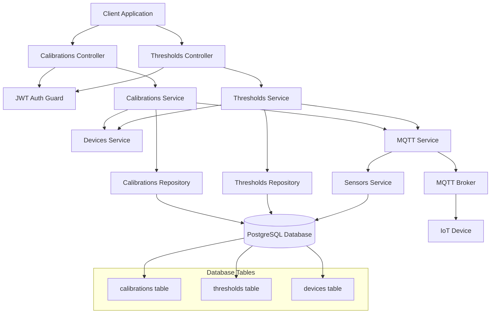
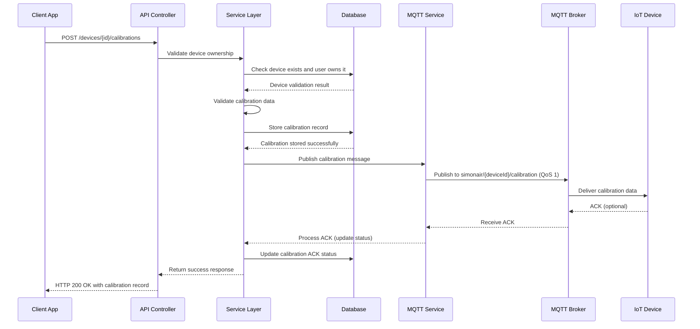

# MQTT Device Communication Design Document

## Overview

The MQTT Device Communication system extends the existing SimonAir platform to enable real-time bidirectional communication with IoT aquarium monitoring devices. Built on top of the existing NestJS architecture, this system handles HTTP API requests for device calibrations and thresholds, then publishes formatted MQTT messages to configure devices according to the SIMONAIR protocol specification.

The design integrates seamlessly with the existing MqttService, DevicesService, and related modules while adding new controller endpoints and service methods specifically for calibration and threshold management. The system ensures reliable message delivery using QoS 1 and maintains data persistence for audit and troubleshooting purposes.

## Architecture

### System Components



### MQTT Communication Flow



## Components and Interfaces

### New Controller Endpoints

#### Calibrations Controller
```typescript
interface CalibrationsController {
  // POST /devices/:deviceId/calibrations
  sendCalibration(
    deviceId: string, 
    calibrationData: CalibrationRequestDto, 
    user: User
  ): Promise<CalibrationResponseDto>;
  
  // GET /devices/:deviceId/calibrations
  getCalibrationHistory(
    deviceId: string, 
    user: User
  ): Promise<CalibrationHistoryResponseDto>;
}
```

#### Thresholds Controller
```typescript
interface ThresholdsController {
  // POST /devices/:deviceId/thresholds
  sendThresholds(
    deviceId: string, 
    thresholdData: ThresholdRequestDto, 
    user: User
  ): Promise<ThresholdResponseDto>;
  
  // GET /devices/:deviceId/thresholds
  getCurrentThresholds(
    deviceId: string, 
    user: User
  ): Promise<ThresholdConfigResponseDto>;
}
```

### Service Layer Interfaces

#### Enhanced MQTT Service
```typescript
interface IMqttService {
  // Existing methods
  publishCalibration(deviceId: string, calibrationData: any): void;
  publishOffset(deviceId: string, offsetData: any): void;
  
  // New methods for enhanced functionality
  publishCalibrationWithValidation(
    deviceId: string, 
    calibrationData: CalibrationData
  ): Promise<void>;
  
  publishThresholdsWithValidation(
    deviceId: string, 
    thresholdData: ThresholdData
  ): Promise<void>;
  
  validateMqttConnection(): Promise<boolean>;
}
```

#### Calibrations Service
```typescript
interface ICalibrationsService {
  sendCalibration(
    deviceId: string, 
    calibrationData: CalibrationRequestDto, 
    user: User
  ): Promise<Calibration>;
  
  getCalibrationHistory(
    deviceId: string, 
    user: User
  ): Promise<Calibration[]>;
  
  validateCalibrationData(
    sensorType: string, 
    calibrationData: any
  ): void;
}
```

#### Thresholds Service
```typescript
interface IThresholdsService {
  sendThresholds(
    deviceId: string, 
    thresholdData: ThresholdRequestDto, 
    user: User
  ): Promise<Threshold>;
  
  getCurrentThresholds(
    deviceId: string, 
    user: User
  ): Promise<Threshold>;
  
  validateThresholdData(thresholdData: any): void;
  formatThresholdForMqtt(thresholdData: any): any;
}
```

## Data Models

### Database Schema

#### Enhanced Calibrations Table
The existing calibrations table will be used with additional fields for MQTT tracking:
```sql
-- Existing table structure (from calibration.entity.ts)
CREATE TABLE calibrations (
    id UUID PRIMARY KEY DEFAULT gen_random_uuid(),
    device_id VARCHAR(20) NOT NULL,
    sensor_type VARCHAR(20) NOT NULL,
    calibration_data JSONB NOT NULL,
    applied_at TIMESTAMP DEFAULT CURRENT_TIMESTAMP,
    applied_by UUID REFERENCES users(id),
    
    -- Additional fields for MQTT tracking
    mqtt_published_at TIMESTAMP,
    mqtt_ack_received_at TIMESTAMP,
    mqtt_ack_status VARCHAR(20) DEFAULT 'pending', -- pending, success, failed
    mqtt_retry_count INTEGER DEFAULT 0
);

-- Indexes for performance
CREATE INDEX idx_calibrations_device_sensor_time ON calibrations(device_id, sensor_type, applied_at DESC);
CREATE INDEX idx_calibrations_mqtt_status ON calibrations(mqtt_ack_status, mqtt_published_at);
```

#### Enhanced Thresholds Table
The existing thresholds table already has ACK tracking fields:
```sql
-- Existing table structure (from threshold.entity.ts)
CREATE TABLE thresholds (
    id UUID PRIMARY KEY DEFAULT gen_random_uuid(),
    device_id VARCHAR(20) UNIQUE NOT NULL,
    threshold_data JSONB NOT NULL,
    updated_at TIMESTAMP DEFAULT CURRENT_TIMESTAMP,
    updated_by UUID REFERENCES users(id),
    ack_status VARCHAR(20) DEFAULT 'pending',
    ack_received_at TIMESTAMP,
    
    -- Foreign key constraints
    CONSTRAINT fk_thresholds_device FOREIGN KEY (device_id) REFERENCES devices(device_id) ON DELETE CASCADE,
    CONSTRAINT fk_thresholds_user FOREIGN KEY (updated_by) REFERENCES users(id) ON DELETE SET NULL
);

-- Indexes for performance
CREATE INDEX idx_thresholds_device ON thresholds(device_id);
CREATE INDEX idx_thresholds_ack_status ON thresholds(ack_status, updated_at);
```

### Calibration Request/Response DTOs

#### CalibrationRequestDto
```typescript
class CalibrationRequestDto {
  @IsIn(['ph', 'tds', 'do'])
  sensor_type: string;
  
  @ValidateNested()
  @Type(() => CalibrationDataDto)
  calibration_data: CalibrationDataDto;
}

class CalibrationDataDto {
  // pH calibration
  @IsOptional()
  @IsNumber()
  m?: number; // slope
  
  @IsOptional()
  @IsNumber()
  c?: number; // intercept
  
  // TDS calibration
  @IsOptional()
  @IsNumber()
  v?: number; // voltage
  
  @IsOptional()
  @IsNumber()
  std?: number; // standard
  
  @IsOptional()
  @IsNumber()
  t?: number; // temperature
  
  // DO calibration
  @IsOptional()
  @IsNumber()
  ref?: number; // reference
}
```

#### ThresholdRequestDto
```typescript
class ThresholdRequestDto {
  @IsOptional()
  @IsNumberString()
  ph_min?: string;
  
  @IsOptional()
  @IsNumberString()
  ph_max?: string;
  
  @IsOptional()
  @IsNumberString()
  tds_min?: string;
  
  @IsOptional()
  @IsNumberString()
  tds_max?: string;
  
  @IsOptional()
  @IsNumberString()
  do_min?: string;
  
  @IsOptional()
  @IsNumberString()
  do_max?: string;
  
  @IsOptional()
  @IsNumberString()
  temp_min?: string;
  
  @IsOptional()
  @IsNumberString()
  temp_max?: string;
}
```

### MQTT Message Formats

#### Calibration MQTT Payload
```typescript
// pH calibration
{
  "ph": {
    "m": -7.153,
    "c": 22.456
  }
}

// TDS calibration
{
  "tds": {
    "v": 1.42,
    "std": 442,
    "t": 25.0
  }
}

// DO calibration
{
  "do": {
    "ref": 8.0,
    "v": 1.171,
    "t": 25.0
  }
}
```

#### Threshold MQTT Payload
```typescript
{
  "threshold": {
    "ph_good": 6.5,
    "ph_bad": 8.5,
    "tds_good": 200,
    "tds_bad": 800,
    "do_good": 5.0,
    "do_bad": 12.0,
    "temp_low": 20.0,
    "temp_high": 30.0
  }
}
```

## Error Handling

### Validation Error Responses
```typescript
interface ValidationErrorResponse {
  status: 'error';
  error: {
    code: 400;
    message: 'Validation failed';
    details: {
      field: string;
      message: string;
      value: any;
    }[];
  };
  metadata: {
    timestamp: string;
    path: string;
  };
}
```

### MQTT Error Handling
- Connection failures: Return HTTP 503 Service Unavailable
- Publish failures: Retry up to 3 times with exponential backoff
- Validation failures: Return HTTP 400 with specific field errors
- Authorization failures: Return HTTP 403 Forbidden
- Device not found: Return HTTP 404 Not Found

## Security Considerations

### Authentication & Authorization
- JWT authentication required for all endpoints
- Device ownership validation before MQTT operations
- Role-based access control (users can only access their devices)
- Admin/superuser roles can access all devices

### Data Validation
- Strict validation of calibration data based on sensor type
- Threshold value range validation
- Device ID format validation (SMNR-XXXX)
- MQTT payload sanitization

### MQTT Security
- Secure WebSocket connection (WSS) to MQTT broker
- Username/password authentication for MQTT client
- QoS 1 for reliable message delivery
- Topic-based access control

## Performance Optimizations

### MQTT Connection Management
- Single persistent connection with automatic reconnection
- Connection pooling for high-throughput scenarios
- Message queuing during connection outages
- Exponential backoff for reconnection attempts

### Database Optimizations
- Indexed queries on device_id and sensor_type
- Batch operations for multiple calibrations
- Efficient JSON storage for calibration and threshold data
- Proper foreign key relationships

### Caching Strategy
- Cache device ownership validation results
- Cache MQTT connection status
- TTL-based cache invalidation
- Redis-based caching for scalability

## Integration Points

### Existing System Integration
- **DevicesService**: Device validation and ownership checks
- **MqttService**: Enhanced with new publishing methods
- **Calibrations Module**: Extended with MQTT functionality
- **Thresholds Module**: Extended with MQTT functionality

### External System Integration
- **MQTT Broker**: WSS connection to mqtt-ws.elsaiot.web.id
- **IoT Devices**: Following SIMONAIR protocol specification
- **WebSocket Gateway**: Real-time updates to connected clients

## API Design

### RESTful Endpoints

#### Calibration Endpoints
```
POST /devices/{deviceId}/calibrations
- Send calibration data to device via MQTT
- Request body: CalibrationRequestDto
- Response: CalibrationResponseDto

GET /devices/{deviceId}/calibrations
- Get calibration history for device
- Query params: page, limit, sensor_type
- Response: CalibrationHistoryResponseDto
```

#### Threshold Endpoints
```
POST /devices/{deviceId}/thresholds
- Send threshold configuration to device via MQTT
- Request body: ThresholdRequestDto
- Response: ThresholdResponseDto

GET /devices/{deviceId}/thresholds
- Get current threshold configuration
- Response: ThresholdConfigResponseDto
```

### Response Format Standardization
All responses follow the existing platform standard:
```typescript
{
  status: 'success' | 'error',
  data?: any,
  error?: ErrorDetails,
  metadata: {
    timestamp: string,
    path: string,
    executionTime?: number
  }
}
```

## Testing Strategy

### Unit Testing
- Calibration and threshold validation logic
- MQTT message formatting
- Error handling scenarios
- Service layer business logic

### Integration Testing
- Controller endpoint testing with authentication
- MQTT service integration testing
- Database persistence testing
- Device ownership validation

### End-to-End Testing
- Complete calibration workflow (HTTP → MQTT → Device)
- Threshold configuration workflow
- Error scenarios and recovery
- Multi-user device access scenarios

## Monitoring and Logging

### MQTT Operation Logging
- All publish operations with timestamps
- Connection status changes
- Message delivery confirmations
- Error conditions and retries

### Performance Metrics
- MQTT message publish latency
- Database operation timing
- API response times
- Error rates and types

### Health Checks
- MQTT broker connectivity
- Database connection status
- Service availability monitoring
- Device communication status